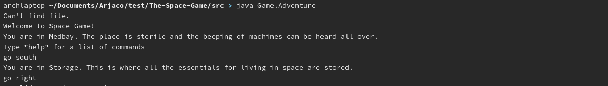

# The space game  

A quick fun ASCII game about exploring the depts of space  
_Good luck out there_  

<details open="open">
  <summary>Table of Contents</summary>
  <ol>
    <li>
      <a href="#about-the-project">About The Project</a>
      <ul>
        <li><a href="#built-with">Built With</a></li>
      </ul>
    </li>
    <li>
      <a href="#getting-started">Getting Started</a>
      <ul>
        <li><a href="#prerequisites">Prerequisites</a></li>
        <li><a href="#installation">Installation</a></li>
      </ul>
    </li>
    <li><a href="#usage">Usage</a></li>
    <li><a href="#roadmap">Roadmap</a></li>
    <li><a href="#contributing">Contributing</a></li>
    <li><a href="#licence">License</a></li>
    <li><a href="#contact">Contact</a></li>
  </ol>
</details>

## About The Project


The code was written for a school project ...

### Built With
 - Nothing special, just our bare hands

## Getting Started

To get a local copy up and running follow these simple steps.

### Prerequisites
The game has been tested with openjdk version "17" (java) _It might work on older releases of the languge but it might not work optimally_

### Installation
1. Clone the repo
   ```sh
   git clone https://github.com/Danish-Pirate/The-Space-Game
   ```

2. Compiling and running the files

    - Unix systems
        ```sh
        cd The-Space-Game/src
        javac Game/Adventure.java  
        ls -l Game/   
        ```      

        If that worked you will now see some additional `.class` files in the directory `Game/`

        To run the files you can now run
        ```sh
        java Game.Adventure
        ```

        It is important that you are still within the `src/` directory

        If you dont get the sounds playing _it will tell you in the console "file not found"_ move the `SPACE_EXPLORE.wav` file to `src/SPACE_EXPLORE.wav` and it should work

        You now have the game setup and ready to start on your unix system

    - Windows Systems
        `...`

## Usage

Now that you are in the game its pretty simple, you can use the following commands to move around the map

```
go north
go south
go east
go west
```

If there is no place to go in that direction it will tell you

To toggle the music you can use `start music` and `stop music`

You can also use `exit` to leave and `look` to get a discription of the room youre currently in

## Roadmap

See the [open issues](https://github.com/Danish-Pirate/The-Space-Game/issues) for a list of proposed features (and known issues).


## Contributing

Contributions are what make the open source community such an amazing place to learn, inspire, and create. Any contributions you make are **greatly appreciated**.

1. Fork the Project
2. Create your Feature Branch (`git checkout -b feature/AmazingFeature`)
3. Commit your Changes (`git commit -m 'Add some AmazingFeature'`)
4. Push to the Branch (`git push origin feature/AmazingFeature`)
5. Open a Pull Request


## Licence

Copyright © 2021 -copyright holders-

Permission is hereby granted, free of charge, to any person obtaining a copy of this software and associated documentation files (the “Software”), to deal in the Software without restriction, including without limitation the rights to use, copy, modify, merge, publish, distribute, sublicense, and/or sell copies of the Software, and to permit persons to whom the Software is furnished to do so, subject to the following conditions:

The above copyright notice and this permission notice shall be included in all copies or substantial portions of the Software.

THE SOFTWARE IS PROVIDED “AS IS”, WITHOUT WARRANTY OF ANY KIND, EXPRESS OR IMPLIED, INCLUDING BUT NOT LIMITED TO THE WARRANTIES OF MERCHANTABILITY, FITNESS FOR A PARTICULAR PURPOSE AND NONINFRINGEMENT. IN NO EVENT SHALL THE AUTHORS OR COPYRIGHT HOLDERS BE LIABLE FOR ANY CLAIM, DAMAGES OR OTHER LIABILITY, WHETHER IN AN ACTION OF CONTRACT, TORT OR OTHERWISE, ARISING FROM, OUT OF OR IN CONNECTION WITH THE SOFTWARE OR THE USE OR OTHER DEALINGS IN THE SOFTWARE.


## Contact

name - [@discordusername](https://www.discordapp.com) - email

Project Link: [https://github.com/Danish-Pirate/The-Space-Game](https://github.com/Danish-Pirate/The-Space-Game)

